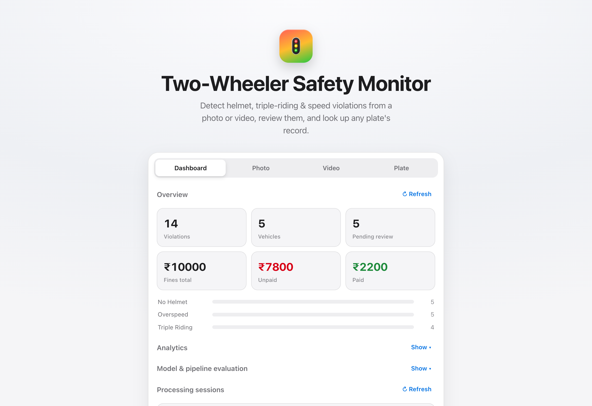
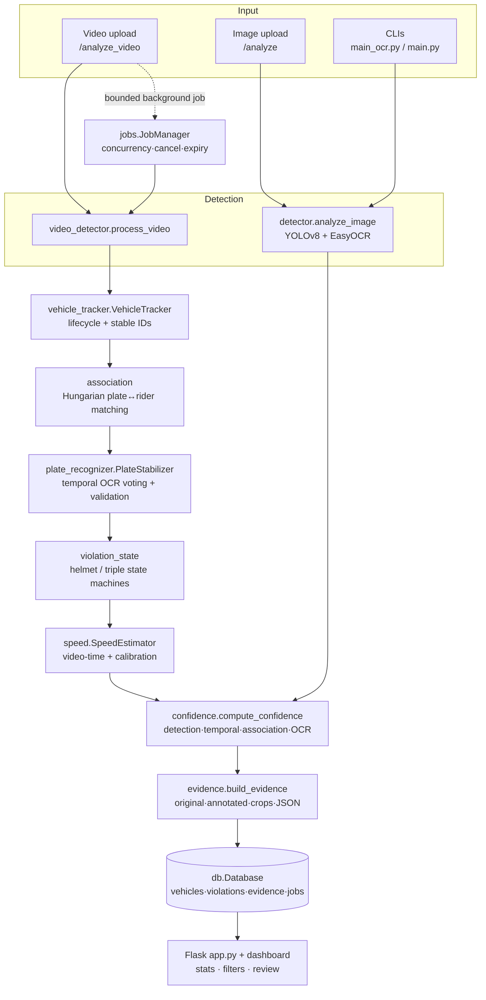

# Two-Wheeler Safety

A computer-vision system that detects two-wheeler traffic violations (no-helmet,
triple-riding, overspeed) in photos and video, reads the number plate, confirms
each violation over time, scores its confidence, packages auditable evidence,
and surfaces everything in a review dashboard.

> **It is a prototype detection & review assistant, not a legal enforcement
> system.** Model predictions are confidence-scored, never treated as ground
> truth, and are meant to be confirmed by a human before any action. See
> [Limitations](#limitations) and [docs/PRIVACY.md](docs/PRIVACY.md).



<sub>The review dashboard (populated with the one-command demo). Try it in ~30 s with `make demo` — no model or weights required.</sub>

---

## What it does

- **Helmet-violation detection** — flags riders without a helmet, with an
  explicit safeguard against the model contradicting itself on one rider.
- **Triple-riding detection** — flags three-up on a two-wheeler.
- **Overspeed detection** — estimates per-vehicle speed from *video time* (with
  camera calibration) and flags vehicles over a limit.
- **Number-plate OCR** — reads the plate from a tight crop, stabilized across
  frames so a single noisy frame can't set the plate a fine is written against.
- **Vehicle tracking & association** — groups each frame's independent detections
  into per-vehicle instances and follows them with stable IDs, so a violation is
  attributed to the *right* bike.
- **Temporal confirmation** — a violation must persist over several frames before
  it is recorded, filtering single-frame misfires.
- **Confidence scoring** — every recorded violation carries a 0–1 confidence
  built from four components (detection / temporal / association / OCR).
- **Evidence generation** — a structured package (original + annotated frame,
  plate crop, violation crop, JSON sidecar) per confirmed violation.
- **Fine recording & plate lookup** — normalized SQLite store; look up any plate
  to see its violations and the registration region decoded from the plate.
- **Human-in-the-loop review** — each violation is `pending` until a person
  `confirmed`s or `dismissed`s it.
- **Web dashboard** — overview stats, filterable/paginated violations, an
  evidence viewer, and the review workflow.

## Why this project is technically interesting

This is not "YOLO detects helmets". The hard parts are the engineering *around*
the model, because a raw object detector is not enough to write a defensible
violation:

- **Cross-object association.** The model detects plate boxes and violation boxes
  *independently*. Deciding which plate belongs to which rider — with several
  bikes in frame — is a matching problem, solved here with Hungarian assignment
  over a per-vehicle cost, not a fragile nearest-neighbour guess.
- **Noisy OCR.** Plate text jitters frame to frame. A temporal stabilizer votes
  across frames and validates plate *structure* before a reading is trusted.
- **Confidently-wrong CV.** Detectors produce false positives and can be
  confidently wrong. Temporal state machines require persistence, and a
  contradiction safeguard refuses to guess when the model asserts both
  helmet and no-helmet on the same rider.
- **Video speed must use video time, not wall-clock time.** A slower machine
  processes fewer frames per real second; using processing time would change the
  reported vehicle speed. Speed is computed from `frame_index / fps`.
- **Auditability.** A fine is only as good as its evidence, so each one ships a
  structured, timestamped package with a full confidence breakdown.
- **No duplicate fines.** A vehicle in view for 200 frames must produce at most
  one fine per violation — handled by per-(track, violation) de-duplication.
- **Safe uploads / API.** Uploads are sniffed and size-capped, paths are
  traversal-proof, the write API can require a key, and video runs as a bounded,
  cancellable background job.

The honest thesis this project is built to demonstrate: **a strong pipeline
around an imperfect detector is still bounded by the detector.** The engineering
here makes the detector's output *defensible* — associated, confirmed over time,
de-duplicated, confidence-scored and auditable — but it cannot exceed what the
model can see. The evaluation below measures both layers separately so neither is
mistaken for the other, and the error budget says where effort actually pays off.

## Architecture



Full detail: [docs/ARCHITECTURE.md](docs/ARCHITECTURE.md). The *why* behind the
key choices: [docs/DECISIONS.md](docs/DECISIONS.md).

### Video pipeline

`modules/video_detector.py` (`process_video`) is the reusable video pipeline the
web app and `main.py` both run (one implementation, no drift). Per frame it runs
the model, hands the raw boxes to `VehicleTracker`, which groups them into
per-vehicle instances (rider body + its plate, matched one-to-one via Hungarian
assignment in `modules/association.py`) and follows each vehicle across frames
with a lifecycle (`tentative → confirmed → lost`) and stable IDs. This replaced
the old "attribute each violation to the nearest tracked plate" heuristic, which
mis-assigns when bikes are close together.

### OCR pipeline

`modules/plate_recognizer.py` (`PlateStabilizer`) accumulates per-frame OCR
readings for a vehicle, normalizes them, votes across frames, and validates the
elected plate against Indian plate *structure* before it is trusted. A fine is
written only against this temporally-stable plate, never a single frame's read.
`modules/plate_info.py` then decodes the plate's registration region (state + RTO
district) from the public, static plate-code scheme — no external API.

### Violation decision engine

`modules/violation_state.py` holds two deterministic per-vehicle state machines
(helmet, triple-riding). A violation must clear a confidence threshold and
persist for `STREAK_THRESHOLD` frames before it confirms; it returns to a clean
state gracefully when the evidence disappears. The helmet machine keeps the
contradiction safeguard: when the model asserts both helmet and no-helmet on one
rider it advances neither.

`modules/confidence.py` combines four signals — **detection** (box confidence),
**temporal** (streak / needed), **association** (how well the plate sits under
the rider), and **OCR** (stabilizer agreement) — into one score via a
transparent weighted mean.

> **Confidence is a score in [0, 1], not a calibrated probability.** It has not
> been measured against ground truth, so the code, the API, and the UI
> deliberately never call it a probability or render it as "97% likely". The
> dashboard shows the raw score and its component breakdown.

### Speed estimation

`modules/speed.py` (`SpeedEstimator`) converts pixel displacement to km/h.

- **Video time.** `estimate()` takes a timestamp in *video seconds*
  (`frame_index / fps`), so the result is independent of processing speed.
- **Calibration.** `pixels_per_meter` (from `calibrate_pixels_per_meter`) is
  required; without it, speed/overspeed is skipped rather than reported
  meaninglessly. An optional `LinearPlaneCalibration` gives a coarse
  perspective correction.
- **Smoothing & uncertainty.** Instantaneous estimates are median-smoothed,
  physically-impossible jumps are rejected, a minimum sample count/duration is
  required, and each estimate carries an uncertainty (spread of recent samples).
- **Limitations.** Assumes motion roughly perpendicular to the camera; a vehicle
  moving toward/away reads artificially slow. It is an estimate, not a calibrated
  radar reading.

### Evidence

Per confirmed violation, `modules/evidence.py` writes: the original frame, the
annotated frame, a plate crop, a violation crop, and a JSON sidecar with
timestamp, frame index, track id, plate, violation, the full confidence
breakdown, supporting-frame count, and any speed/calibration data. Filenames are
uniquely tokenized; stored paths are basenames so the directory stays portable
and servable via `/evidence/<name>`.

### Database

`modules/db.py` — normalized SQLite (`vehicles` / `violations` / `evidence` /
`processing_jobs`, plus a reserved `detections`), foreign keys on, related
inserts in one transaction, indexed on the common lookups. `violations` carries
a confidence, a payment `status`, and human-review columns
(`review_status` / `reviewer_decision` / `reviewed_at` / `review_notes`).
`initialize()` creates everything `IF NOT EXISTS`, migrates a legacy flat `fines`
table once, and `ALTER`s in the review columns for a database created before that
workflow existed.

### API

Full reference with request/response examples: [docs/API.md](docs/API.md).

| Method | Route | Purpose |
|---|---|---|
| GET | `/` | Dashboard UI |
| GET | `/health` | Liveness/readiness (models-loaded flag) |
| POST | `/analyze` | Analyze an uploaded image, record violations |
| POST | `/analyze_video` | Start a background video job → `{job_id}` |
| GET | `/video_status/<job_id>` | Poll job progress / result |
| POST | `/video_cancel/<job_id>` | Cooperatively cancel a job |
| POST | `/detect` | Record one violation (API-key gated if configured) |
| GET | `/get_fines/<plate>` | Fines + unpaid total + decoded region for a plate |
| GET | `/fines` | All fines (legacy flat shape) |
| GET | `/api/stats` | Dashboard overview aggregates |
| GET | `/api/violations` | Filtered, paginated violations |
| GET | `/api/violations/<id>` | One violation + evidence URLs |
| POST | `/api/violations/<id>/review` | Record a review decision |
| GET | `/evidence/<file>` | Serve an evidence image/video |

## Configuration

All runtime knobs live in one typed layer (`modules/config.py`), built from the
environment. Every variable the project reads:

| Variable | Default | Purpose |
|---|---|---|
| `MODEL_PATH` | `runs/detect/traffic_model-2/weights/best.pt` | YOLO weights |
| `TRAFFIC_DB_PATH` | `traffic.db` | SQLite path |
| `EVIDENCE_DIR` | `evidence` | Where evidence images/videos are written/served |
| `LOG_LEVEL` | `INFO` | Application log level |
| `HOST` | `127.0.0.1` | Dev-server bind host |
| `PORT` | `5000` | Port |
| `FLASK_DEBUG` | `0` (off) | Set `1` only for local dev (debugger runs arbitrary code) |
| `DETECT_API_KEY` | unset | If set, `/detect` requires this `X-API-Key` |
| `MAX_UPLOAD_MB` | `200` | Hard request-size cap (413 above it) |
| `RATE_LIMIT_PER_MIN` | `120` | Per-IP limit on write/upload endpoints |
| `MAX_CONCURRENT_VIDEO_JOBS` | `2` | Concurrency cap for video jobs |
| `JOB_MAX_AGE_S` | `3600` | Finished-job retention before expiry |
| `MAX_VIDEO_MB` | `100` | Per-video upload cap |
| `MAX_VIDEO_SECONDS` | `300` | Processing-time ceiling per video |
| `DETECT_CONF_THRESHOLD` | `0.25` | YOLO min box confidence |
| `STREAK_THRESHOLD` | `5` | Frames a violation must persist to confirm |
| `HELMET_MIN_CONF` | `0.3` | Min confidence for a no-helmet frame to count |
| `TRIPLE_MIN_CONF` | `0.3` | Min confidence for a triple-riding frame |
| `SPEED_LIMIT_KMH` | `40` | Overspeed threshold |
| `MAX_VIDEO_WIDTH` | `1280` | Frames wider than this are downscaled |
| `CONTRADICTION_IOU` | `0.1` | Helmet/no-helmet overlap = same rider |

## Running locally

**Fastest look (no model, no weights):** seed a self-contained demo and serve it
with only the model-free deps installed —

```bash
pip install -r requirements-ci.txt -c constraints-ci.txt
make demo                 # or: python3 demo.py   → http://127.0.0.1:5000
```

This populates the dashboard, analytics, sessions, review flow, and plate lookup
with clearly-labelled synthetic demo data so there's something to click. See
[docs/DEMO.md](docs/DEMO.md). For the real detector on your own footage:

```bash
python3 -m venv .venv && source .venv/bin/activate   # Python 3.11–3.13
pip install -r requirements.txt -c constraints-runtime.txt
python3 app.py            # http://127.0.0.1:5000
```

The full stack is platform-specific because of torch (install the CUDA build
first on an NVIDIA host). Reproducible, pinned setup for every profile —
contributor/test, full runtime, production — is in
[docs/INSTALL.md](docs/INSTALL.md).

The UI has four tabs: **Dashboard** (stats, violations, review), **Photo**
(server-side detection on an upload), **Video** (background processing with a
progress bar + cancel), and **Plate** (look up a plate's record). Models load
lazily on the first upload (a few seconds), then stay cached.

Seed a small, realistic demo set (runs the real detector on bundled sample
photos so each plate has genuine evidence):

```bash
python3 seed_demo.py          # wipes existing fines, then seeds
python3 seed_demo.py --keep   # keep existing, just add the demo set
```

Command-line detection:

```bash
python3 main_ocr.py --image your_photo.jpg              # single image
python3 main.py --source your_video.mp4                 # video (shared pipeline)
python3 main.py --source your_video.mp4 --pixels-per-meter 68   # enable speed
python3 main.py --source 0 --no-report                  # webcam, no API POST
```

No weights, datasets, or videos ship in the repo (all gitignored). Train first
(below) or point `MODEL_PATH` at your own weights. Full walkthrough:
[docs/DEMO.md](docs/DEMO.md).

## Testing

```bash
pip install -r requirements-ci.txt -c constraints-ci.txt   # model-free, pinned
pytest                     # 466 tests, ~5s
```

The suite is **model-free by design** — heavy inference (torch/ultralytics/
easyocr) is isolated behind lazy imports and never exercised in tests, so the
suite runs in ~5s and CI needs no GPU or weights. Coverage: the tracker,
association, OCR stabilizer/validation, speed & calibration, confidence engine,
both violation state machines, evidence packaging, the normalized DB (incl.
migration, review workflow, filtering/pagination, sort-injection safety), the
Flask routes (upload validation, API-key gating, analytics/filter/review APIs),
the job manager, the evaluation primitives, and CLI helpers (incl. the
helmet-contradiction bug regression). Model *accuracy* is evaluated separately
(below), not in unit tests.

## Model training

`train_traffic.py` trains the 4-class YOLOv8 model
(`Plate`, `WithHelmet`, `WithoutHelmet`, `TripleRiding`):

```bash
python3 train_traffic.py \
    --data master_traffic_violation_dataset/data.yaml \
    --epochs 50 --imgsz 640 --batch 16 --device auto --name traffic_model
```

Outputs land in `runs/detect/<name>/`: `weights/best.pt` (point `MODEL_PATH` at
it), curves, `results.csv`, and a confusion matrix. It runs validation once after
training and prints the headline metrics.

## Evaluation

Three different things get called "performance" in a CV project, and conflating
them is the easiest way to mislead. They are measured separately here and never
combined.

### Model performance — the detector alone

*"How good is YOLO at finding and classifying boxes?"* On the **de-leaked
held-out test split** (175 images, 293 instances), `traffic-4class@1.0.0`:

| | mAP@50 | mAP@50-95 | precision | recall |
|---|---:|---:|---:|---:|
| overall | **0.727** | **0.532** | 0.756 | 0.785 |

| class | mAP@50 | F1 |
|---|---:|---:|
| `TripleRiding` | 0.950 | 0.921 |
| `Plate` | 0.863 | 0.884 |
| `WithoutHelmet` | 0.705 | 0.716 |
| `WithHelmet` | **0.387** | **0.519** |

`WithHelmet` is the weak class, on 27 test instances — high-variance and the one
place a wrong call becomes a wrong fine. Confidence ranks correctness well for
`WithoutHelmet` (Spearman 1.00) and **not at all** for `TripleRiding`
(−0.20). Full analysis, per-class error breakdown, saved failure crops and the
four-checkpoint A/B: **[docs/MODEL_EVALUATION.md](docs/MODEL_EVALUATION.md)**.

> The held-out split was audited, not assumed: 9.8% of `test` and 8.1% of `val`
> were near-duplicates of training images. De-leaking moved mAP@50 by +0.006 —
> the leakage was not inflating the result. `python3 audit_dataset.py`.

### Pipeline performance — the logic on top of the detector

*"How often does the complete pipeline produce a correct, correctly-attributed
fine?"* Measured on deterministic synthetic scenarios driven through the **real**
tracker, association, stabilizer and state machines — no weights needed:

- **The pipeline beats a single-frame detector at every noise level.** Given
  identical detections, a naive "fine if any frame shows a violation" policy
  averages **1.50 false positives even at zero detector noise** (precision
  0.838); the full pipeline has **0.00** (precision 1.000). Under 10% detector
  class-confusion noise: naive F1 0.840 vs pipeline **0.994**. Naive recall is
  always 1.000 — it fines on anything — so the entire difference is precision.
- **End-to-end fines: precision 1.000, recall 1.000** over 8 multi-bike
  scenarios (TP 8, FP 0, FN 0, 0 misattributions).
- **Temporal confirmation is worth measuring:** fining on a single frame drops
  helmet precision to **0.67** and triple-riding to **0.80**; two frames restores
  1.00 at no recall cost.
- **Temporal OCR voting converts errors into abstentions:** at 12% character
  noise, last-frame OCR names the wrong plate 85% of the time, best-confidence
  30%, the shipped stabilizer **2%** — answering 51% of the time instead of 100%.
- **Error budget:** OCR is the bottleneck at **76.8%** of measured system
  sensitivity, ahead of detector class-confusion (15.3%) and detector recall
  (7.3%). A *corrupted* plate misattributes a fine; a *missing* one costs almost
  nothing, because other frames recover it.
- **Speed:** best MAE 11.3 km/h toward camera (homography); a constant
  pixels-per-metre calibration misses *every* overspeeder in that geometry.

Full report: **[docs/END_TO_END_EVALUATION.md](docs/END_TO_END_EVALUATION.md)**.

### Application performance — throughput and latency

*"How fast does it run?"* Apple M4 / MPS: model load ≈ 2.9 s (one-time), single
image inference 24.2 ms (≈41 FPS), EasyOCR on a plate crop 14.2 ms, peak RSS
987 MB. Video throughput **50.2 FPS** with the OCR lock enabled vs 28.7 FPS
without — **+74.9%** for 5 OCR calls instead of 120, with an identical recorded
fine. Per-frame time is 88% YOLO and 9% OCR; everything the project wrote
around them (tracking, association, evidence, DB, encode) is **under 2%
combined**. Per-stage breakdown: [docs/EVALUATION.md](docs/EVALUATION.md) §6.

### Running the evaluations

```bash
# model-free: no weights, no dataset, no network (this is what CI runs)
python3 evaluate_pipeline.py

# needs local weights + dataset
python3 audit_dataset.py --data <data.yaml> --write-clean-split eval/clean_splits
python3 evaluate_model.py --model <weights.pt> --data eval/clean_splits/data.yaml \
    --split test --save-artifacts eval --benchmark
python3 compare_models.py --data eval/clean_splits/data.yaml --split test
python3 evaluate_ocr.py --simulate --sweep
```

It uses Ultralytics `val()` for authoritative per-class precision/recall and
mAP@50 / mAP@50-95, and a second matching pass (`modules/evaluation.py`) for what
`val()` doesn't expose per image: class confusions (including the
`WithHelmet ↔ WithoutHelmet` failure mode), representative false positives/
negatives, and whether confidence separates correct from wrong predictions. A
Markdown + JSON report lands in `reports/`.

Performance (latency/throughput/memory) is measured by `benchmark.py`. Trained
weights and the dataset are not tracked in git, so re-running on your own data
will not reproduce the figures below exactly.

### Two different questions — don't read one as the other

The most common way to misread a project like this is to treat a system-level
number as a computer-vision result. They are separate measurements, and only one
of them is about real footage. Full detail in [docs/EVALUATION.md](docs/EVALUATION.md).

| | **Model performance** | **System engineering** |
|---|---|---|
| **Question** | How good is the detector on real images? | Does the pipeline around the model behave correctly? |
| **Data** | Real annotated dataset, de-leaked held-out test split | **Deterministic synthetic scenarios** |
| **Headline** | mAP@50 **0.727**, mAP@50-95 **0.532**, mean P **0.756**, mean R **0.785** | precision = recall = **1.0** across the suite |
| **What it means** | Middling, and honestly so — see the caveats below | The plumbing is correct: tracking, association, temporal confirmation, de-duplication |
| **What it does *not* mean** | — | **Nothing about field accuracy.** A 1.0 here is a statement about synthetic inputs, not about real roads |

**Caveats that matter more than the headline:**

- **`WithHelmet` is weak (mAP@50 0.387, F1 0.519)** on only **27** test
  instances. That class is under-trained and the number is unstable at that `n`.
- The dataset has known **class imbalance and leakage caveats** (see
  [docs/DATASET.md](docs/DATASET.md)); mAP@50 of 0.727 is a *baseline on this
  dataset*, not a claim about field accuracy.
- **Speed validation is synthetic** — constant-velocity trajectories on a
  perspective grid, not surveyed ground truth.
- **Confidence is a score, not a calibrated probability.** 0.8 does not mean
  "80% likely correct."

The engineering claim this project actually supports is the *system* one: the
detection → tracking → association → temporal-confirmation → evidence path is
correct and tested. The CV claim is a baseline, not a result.
Generated results are committed under `eval/results/` as JSON + Markdown + CSV,
and the docs cite those files rather than hand-transcribed numbers. The
dashboard reads the same files (collapsed "Model & pipeline evaluation" panel)
and shows an explicit "not run yet" state — never a placeholder — when a report
is missing.

## Limitations

Stated in full in [docs/MODEL_EVALUATION.md](docs/MODEL_EVALUATION.md) §8 and
[docs/END_TO_END_EVALUATION.md](docs/END_TO_END_EVALUATION.md) §7. The ones that
matter most:

- **Held out is not the same as generalisation.** The test split comes from the
  same pool as training and shares its biases (cameras, cities, lighting). These
  numbers do not predict performance on a new deployment.
- **`WithHelmet` is genuinely weak** (mAP@50 0.387) on only 27 test instances,
  and the saved artifacts include a confidently wrong helmet call (0.855) on an
  easy frame. Temporal confirmation and the contradiction safeguard filter
  flicker, but not a *steadily* wrong prediction — which is why human review
  exists. Treat no-helmet flags on unfamiliar footage as needing review, not as
  truth.
- **Confidence is a score, not a probability.** It ranks well for some classes
  and not at all for others; "0.8" never means "80% correct".
- **OCR is the system bottleneck** and no *field* OCR accuracy is measured — the
  comparison above uses simulated character noise. A labelled plate-sequence set
  is the single highest-value thing missing.
- **Two-way OCR ties elect rather than abstain** (agreement 0.5 clears the
  threshold) — the weakest point of the voting rule, pinned by a test.
- **Speed is an estimate, not radar.** Best measured MAE 11.3 km/h, needs a
  surveyed homography, assumes constant velocity in the window.
- **Dataset licence and source are UNVERIFIED** — do not redistribute the
  imagery ([data/DATASET_MANIFEST.md](data/DATASET_MANIFEST.md)).
- **Synthetic pipeline scenarios are clean** — no motion blur, no crowds, no
  detector noise. Perfect scores are a ceiling on what the suite tests, not a
  claim about real footage.
- **Single-process** design (in-process jobs, per-process model cache and rate
  limiter) — appropriate for this scale, not a distributed service.
- **Not legal enforcement** and it never resolves owner identity (see Privacy).

## Security

- Uploads: extension allowlist + image magic-byte sniffing, server-controlled
  temp filenames, global size cap, per-video size + processing-time limits.
- Paths: evidence served as a bare basename with a media-type allowlist
  (traversal-proof); caller-supplied `image_path` reduced to a safe basename.
- API: `/detect` can require `X-API-Key`; per-IP rate limiting on write/upload
  routes; JSON validation of plate/violation.
- Server: debugger off by default; binds `127.0.0.1` by default; production runs
  under gunicorn (see below). Details: [docs/DEPLOYMENT.md](docs/DEPLOYMENT.md).

## Privacy & data retention

The system stores plate strings and evidence images and decodes only the public
registration *region* from the plate — it never queries any owner database and
does not know the owner's identity. See [docs/PRIVACY.md](docs/PRIVACY.md) for
what is stored, why, and a recommended retention policy.

## Deployment

Containerized with a Dockerfile (gunicorn, single worker + threads, health
check); weights are mounted, not baked in; DB and evidence persist on a volume.
See [docs/DEPLOYMENT.md](docs/DEPLOYMENT.md).

## Future improvements

Ordered by measured value, not by appeal:

- **A labelled plate-sequence set**, so field OCR accuracy can be measured rather
  than simulated. The error budget says OCR carries 76.8% of system sensitivity,
  so this is the highest-value missing measurement by a wide margin.
- **More `WithHelmet` data** — 27 test instances is too few to steer by, and it
  is the weakest class.
- **Promote `traffic_model_probe`** (wins on both helmet classes) after a proper
  version bump and evidence-trail check — the A/B evidence is already recorded.
- **An externally-sourced test set** (different cameras/cities) for a
  generalisation estimate the current same-pool split cannot give.
- Calibrate confidence against labelled review outcomes so a threshold has a real
  meaning — the tooling exists, the labelled outcomes do not.
- Optional per-detection logging into the reserved `detections` table.

## Not tracked in git

Datasets, trained weights (`*.pt`), `runs/`, `traffic.db`, generated `evidence/`
and `reports/`, evaluation crops and de-leaked splits under `eval/`, and local
experiment scratch — all large, regenerable, and/or imagery of unverified
licence. `eval/results/` **is** committed: small JSON/Markdown/CSV that the docs
cite as the generated source of truth.

## Documentation

- [docs/ARCHITECTURE.md](docs/ARCHITECTURE.md) — components & data flow
- [docs/DECISIONS.md](docs/DECISIONS.md) — engineering decision records
- [docs/API.md](docs/API.md) — HTTP API reference
- [docs/INSTALL.md](docs/INSTALL.md) — reproducible install profiles & pins
- [docs/DEMO.md](docs/DEMO.md) — one-command demo + step-by-step walkthrough
- [docs/MODEL_EVALUATION.md](docs/MODEL_EVALUATION.md) — **detector metrics**, class-wise error analysis, model A/B
- [docs/END_TO_END_EVALUATION.md](docs/END_TO_END_EVALUATION.md) — **pipeline metrics**, error budget, OCR policy
- [docs/EVALUATION.md](docs/EVALUATION.md) — how each evaluation is run, + performance profiling
- [docs/ERROR_ANALYSIS.md](docs/ERROR_ANALYSIS.md) — failure modes & how they're contained
- [docs/RETRAINING_LOOP.md](docs/RETRAINING_LOOP.md) — the evaluate → inspect → retrain → promote process
- [docs/TESTING.md](docs/TESTING.md) — test strategy & coverage
- [docs/SECURITY.md](docs/SECURITY.md) — threat model & controls
- [docs/DEPLOYMENT.md](docs/DEPLOYMENT.md) — running in production
- [docs/PRIVACY.md](docs/PRIVACY.md) — data & privacy
- [docs/MODEL_VERSIONING.md](docs/MODEL_VERSIONING.md) — weights ↔ manifest ↔ evidence
- [docs/DATASET.md](docs/DATASET.md) — dataset provenance & caveats
- [data/DATASET_MANIFEST.md](data/DATASET_MANIFEST.md) — generated dataset manifest (counts, splits, hygiene)
- [docs/BASELINE.md](docs/BASELINE.md) — pre-upgrade baseline audit
- [docs/RESUME.md](docs/RESUME.md) — measured evidence, with the command behind every number
- [CHANGELOG.md](CHANGELOG.md) — release notes (v1.0.0-rc1)

## Tech stack

Python · Ultralytics YOLOv8 · EasyOCR · OpenCV · Flask · SQLite · gunicorn ·
pytest · ruff · GitHub Actions.
