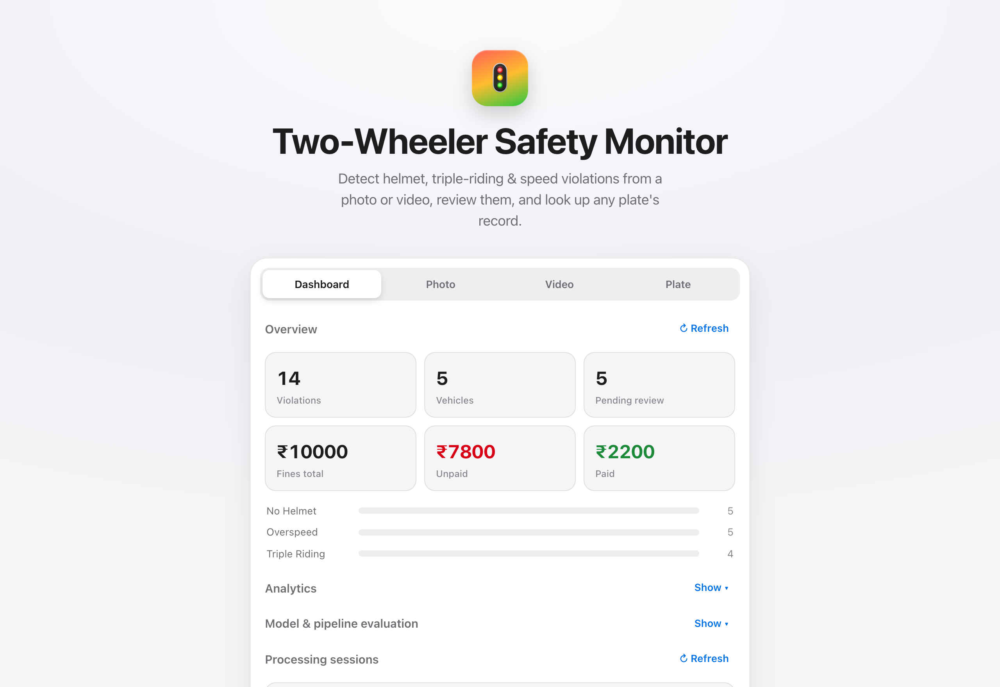
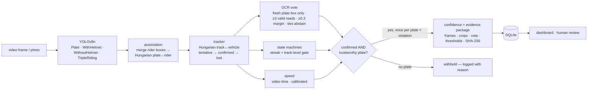

# Two-Wheeler Safety

An evidence pipeline for two-wheeler traffic violations — no helmet, triple
riding, overspeed — that turns an imperfect detector's frame-by-frame guesses
into a small number of **defensible, auditable, human-reviewed** violation
records, and **declines to act when the evidence is weak**.

> **A prototype review assistant, not an enforcement system.** Every record is
> `pending` until a person confirms it. Nothing here has been validated on real
> field footage; see [Limitations](#limitations).

The detector is YOLOv8n and it is mediocre on the class that matters most (it
calls a helmeted rider "no helmet" 15% of the time on validation — 4 of 26
boxes, so a rough figure). The
engineering is everything around it: which plate belongs to which rider, how
long a violation must persist before it counts, when an OCR reading is
trustworthy, how a fine is prevented from being issued twice — and measuring
each of those **separately from the model**, because a good pipeline around a
weak detector is still bounded by the detector.



## Architecture


```mermaid
flowchart LR
    V[video frame / photo] --> Y[YOLOv8n<br/>Plate · WithHelmet ·<br/>WithoutHelmet · TripleRiding]
    Y --> A[association<br/>merge rider boxes →<br/>Hungarian plate↔rider]
    A --> T[tracker<br/>Hungarian track↔vehicle<br/>tentative → confirmed → lost]
    T --> O[OCR vote<br/>fresh plate box only ·<br/>≥3 valid reads · ≥0.3 margin · ties abstain]
    T --> S[state machines<br/>streak + track-level gate]
    T --> SP[speed<br/>video time · calibrated]
    O --> D{confirmed AND<br/>trustworthy plate?}
    S --> D
    SP --> D
    D -->|yes, once per plate × violation| E[confidence + evidence package<br/>frames · crops · vote · thresholds · SHA-256]
    D -->|no plate| W[withheld — logged with reason]
    E --> DB[(SQLite)] --> R[dashboard · human review]
```

Everything from association to the decision lives in one model-free class,
`modules/pipeline.py :: ViolationPipeline`, which the web job runs per frame and
**every evaluator drives directly** — so the pipeline metrics describe the
shipped code. Details: [docs/ARCHITECTURE.md](docs/ARCHITECTURE.md); reasoning:
[docs/DECISIONS.md](docs/DECISIONS.md).

## What makes it hard

- **The detector has no notion of a vehicle.** Plates and riders are separate
  boxes; with several bikes in frame, deciding whose plate is whose is a global
  one-to-one matching problem, not "nearest plate".
- **Single frames are confidently wrong.** Temporal confirmation is the fix — but
  a plain "N frames in a row" rule gets *worse* the longer a rider is in view when
  errors are correlated. The shipped rule was chosen by experiment for that reason.
- **OCR is wrong most of the time per read**, and a wrong plate fines an innocent
  owner. The vote must know when to abstain, and abstention must be recorded, not
  silently dropped.
- **Speed needs video time and calibration** — and calibration measured on the
  source video must survive frame resizing.
- **The data lies in both directions**: missing labels, mislabelled helmets, and
  two source datasets whose label sets never overlap.

## Results — three separate questions

### 1. Detector — *what can the model see?*

`traffic-4class@1.0.0` on the de-leaked held-out **test** split (175 images),
standard protocol, with 95% bootstrap CIs
([MODEL_EVALUATION.md](docs/MODEL_EVALUATION.md)):

| | mAP@50 | mAP@50-95 |
|---|---:|---:|
| all classes (`val()`) | **0.769** | **0.558** |
| all classes (`predict()`, the path the pipeline runs) | 0.750 [0.690, 0.840] | — |

| class | AP@50 `predict()` [95% CI] | instances |
|---|---|---:|
| TripleRiding | 0.963 [0.897, 0.995] | 30 |
| Plate | 0.889 [0.837, 0.938] | 131 |
| WithoutHelmet | 0.734 [0.655, 0.820] | 105 |
| **WithHelmet** | **0.415 [0.204, 0.729]** | 27 |

Model choices were made on validation with paired bootstrap tests — and then
checked against seed noise: retraining v1's exact recipe with a different seed
moves mAP@50 by −0.04 on val (−0.08 on test, "significant" by the bootstrap),
comparable to the recipe changes tried (−0.05 to +0.02). No retrain beat v1 by
more than that, so v1
ships; the numbers above describe the better of two seeds.

### 2. Pipeline — *how reliably do noisy detections become a correct record?*

**Synthetic inputs throughout — decision-logic results, not field accuracy**
([END_TO_END_EVALUATION.md](docs/END_TO_END_EVALUATION.md)):

- **Deterministic scenarios** (side-by-side bikes, crossings, occlusion, late
  plate, re-entry, short dwell): precision **1.0**, recall **0.9** — 0 wrong
  vehicles, 0 wrong plates, 0 duplicate fines; the one miss is a rider in view
  for 0.3 s, a documented cost of the confirmation rule.
- **vs. fining on any single frame**, at identical detections: precision ~1.0 vs
  0.72–0.85 at every noise level; F1 +0.13–0.14 at 10–20% simulated helmet flips
  (the detector's measured rates are 8–15%), +0.06 with no flips, and it
  reverses at 40%.
- **Temporal rule, chosen by experiment** at the detector's *measured* val error
  rates: a plain 5-frame streak flags **31.5%** of helmeted riders seen for 2 s
  under moderately correlated errors; the shipped streak + "≥70% of ≥12 observed
  frames" gate flags **1.2%** (held-out seed). No rule met the 1% target in every
  condition (this one: 1.3% worst on the dev seed), and how correlated real
  errors are is unmeasured — swept, not known; at strong correlation it still
  flags 6–7%.
- **OCR vote, chosen by experiment** with consistent misreads in the noise
  model, scored at the moment a fine is committed: at 4–12% character noise the
  1.0.0 rule named the wrong plate for **40–62%** of simulated vehicles, the
  shipped rule (≥ 3 agreeing reads, margin ≥ 0.3) for **≤ 1.8%** (held-out
  seed) — by naming a plate for only 34–70% of them and withholding the rest.
  It misses the pre-stated 1% target; that is reported, not tuned away.
- **Error budget** (oracle ablation at the measured operating point, synthetic
  scenarios): the pipeline loses 1.5 F1 points to detector noise, and the
  detector owns them — fixing rider detection alone would close the whole gap, helmet classification alone 72–80% of it, plate detection 7–8%, OCR ~0 (stages overlap, so these don't sum). OCR errors cost ~0 F1 because the vote
  withholds instead of guessing; they cost coverage instead.

### 3. Application — *how fast?*

Apple M4, batch 1, `traffic-4class@1.0.0`
([EVALUATION.md](docs/EVALUATION.md) §4, `eval/results/benchmark.md`):

- **Video, shipped settings: 36.7 FPS** on a 334×596 clip (median of 5
  interleaved runs, range 35.0–37.2). YOLO is 65% of frame time, OCR 24%.
- **OCR lock** (stop re-reading a settled plate; re-check every 10 frames):
  19.4 → 36.7 FPS, +88% (per round +80% to +139%), with the same fine in every
  run of both arms.
- YOLO on one 1906×1078 image: 20.5 ms warm on the CPU, 23.2 ms on MPS (p50)
  — one run per device, so no claim that either is faster for YOLOv8n.
- The web layer is not the cost: `/analyze`'s HTTP + validation + DB overhead is
  below the call's own run-to-run noise; the decision core takes 0.04 ms per
  frame for three bikes.

One small clip with one plate on one laptop — not a claim about a camera feed.

## Toward field evidence

Everything past the detector above is synthetic, and the detector is measured
only on still images. The next question is whether any of it survives real
traffic cameras. That can't be answered without labelled footage. What exists now
is the loop that answers it ([docs/FIELD_EVALUATION.md](docs/FIELD_EVALUATION.md),
[docs/ROADMAP.md](docs/ROADMAP.md)):

- **A field dataset layer**: a schema for camera, sequence, vehicle and frame labels
  with annotator/reviewer provenance; splits frozen per sequence or camera-day,
  whole cameras held out as *external*; and a training export plus a trainer
  guard that refuse any image that is (a copy or near-duplicate of) evaluation
  data.
- **A field evaluation harness**: last-frame vs best-read vs temporal OCR on real
  plate crops, and the shipped pipeline over labelled sequences per condition,
  with every missed or wrong fine charged to the first stage that failed.
  **NOT MEASURED** until footage exists.
- **The detector by measured condition, on the real images**: of 25 per-class
  comparisons, 11 cleared 95% on val and 2 replicated on test — and one of those rests on 3 test images.
  Multi-rider scenes look harder for no-helmet on val (AP 0.56 vs 0.84) but not
  on test: a lead, not a result.
- **Reviews as labels**: a dismissal records the failing stage and the true
  plate; calibration now judges out of fold (the old in-sample rule adopted a
  calibrator on already-calibrated scores ~30 times in 40). Real outcomes: 0 —
  **NOT MEASURED**.
- **Active learning**: 150 training images queued by information signal, and a
  50-image *blind*, uniform-random audit of held-out labels — the model never
  chooses which evaluation labels get fixed.
- **Recipes compared by seed means**: v2 (de-duplicated data) leads the v1
  recipe by +0.041 mAP@50 [−0.035, +0.117] with 2 vs 1 seeds — no verdict yet.
  No model was retrained: the weaknesses found need new labels, not new runs.

## What the audit found

This version is the result of a hostile review of v1.0.0
([docs/AUDIT.md](docs/AUDIT.md)): 30 defects, each with evidence and its fix,
and a regression test or regenerated result — then an independent review of the
fixes, which found 8 more. The ones that mattered most:

- **The pipeline metrics didn't measure the shipped pipeline** — evaluators had
  private copies of the decision loop with different settings. Driving the real
  loop exposed four bugs: OCR run on a *stale* plate box, speed read at 2/3 of
  truth on downscaled video, riders fined twice after leaving view, and
  documented thresholds never applied (while evidence claimed they were).
- **The photo path fined every violation against the last plate it read** — with
  two bikes, possibly the wrong rider — and accepted raw OCR text like `0285`.
- **Headline numbers that didn't survive**: mAP computed at the operating
  threshold (0.727 → 0.769 under the standard protocol); an error budget that
  compared per-character OCR noise with per-box detector noise ("OCR is 77% of
  the problem"); model decisions made on the test split; a benchmark that
  labelled CPU numbers "mps".
- **The dataset is two datasets with disjoint labels.** Triple-riding images
  never label plates or heads, so the detector finds a plate on 6% of them (65%
  elsewhere) — on real footage, triple riding will mostly be *withheld*, and no
  held-out metric can show it.
- **The fixes had defects of their own, where it mattered most.** The second
  review found that one valid OCR read plus two unreadable ones could elect a
  plate, that the OCR experiment scored plates after all reads while the
  pipeline commits at the first election, and that the OCR lock let a rider
  inherit another's plate after an identity switch.

## Try it

```bash
pip install -r requirements-ci.txt -c constraints-ci.txt
make demo                  # seeded, clearly labelled demo data; no model needed → http://127.0.0.1:5000
```

With trained weights (not shipped; see [INSTALL.md](docs/INSTALL.md) and
[DEMO.md](docs/DEMO.md)):

```bash
pip install -r requirements.txt -c constraints-runtime.txt
python3 app.py                                   # dashboard + photo/video upload
python3 main_ocr.py --image samples/plate4.jpeg  # one photo, per-vehicle decisions
python3 main.py --source clip.mp4 --pixels-per-meter 68   # video, speed enabled
```

The **Photo** tab lists what the model saw but the rules would not fine, and
why. Each violation's review modal shows how it was decided: supporting frames
vs the rule, the plate vote (agreement, margin, runner-up), the thresholds that
applied, and a live SHA-256 check of its evidence files.

## Evaluate it

```bash
pytest                                   # 712 tests, model-free, ~95% branch coverage of modules/
python3 evaluate_pipeline.py             # pipeline metrics, error budget (no weights)
python3 evaluate_temporal.py             # temporal-rule experiment (no weights)
python3 evaluate_ocr.py --simulate --sweep --policy-sweep --out eval/results --name ocr_policy_simulation
python3 evaluate_model.py --model <weights> --data eval/clean_splits/data.yaml --split test
python3 evaluate_uncertainty.py --split val --models <baseline> <candidate>
```

Every cited number is in a generated file under `eval/results/` that records the
weights hash, dataset fingerprint, git commit, library versions and hardware.
Full list: [docs/EVALUATION.md](docs/EVALUATION.md).

## Configuration

All knobs are environment variables (`modules/config.py`); every detection
threshold below is the value the pipeline applies *and* the value recorded in
evidence.

| Variable | Default | Purpose |
|---|---|---|
| `MODEL_PATH` | `runs/detect/traffic_model-2/weights/best.pt` | YOLO weights |
| `DETECT_DEVICE` | `auto` | `cuda` / `mps` / `cpu`; auto resolves in that order (Ultralytics alone never picks MPS) |
| `DETECT_CONF_THRESHOLD` | `0.25` | detector box floor |
| `STREAK_THRESHOLD` | `5` | consecutive frames to confirm (triple, overspeed, helmet streak) |
| `HELMET_MIN_CONF` | `0.375` | no-helmet frame floor — WithoutHelmet's F1-optimal threshold on val |
| `HELMET_MIN_OBSERVED` / `HELMET_MIN_FRACTION` | `12` / `0.7` | helmet gate: ≥70% no-helmet over ≥12 observed frames |
| `TRIPLE_MIN_CONF` | `0.3` | triple-riding frame floor |
| `CONTRADICTION_IOU` | `0.1` | photos only: no-helmet overlapping any helmet box abstains |
| `SPEED_LIMIT_KMH` | `40` | overspeed threshold (needs calibration) |
| `MAX_VIDEO_WIDTH` | `1280` | frames wider are downscaled (calibration is rescaled with them) |
| `OCR_LOCK_CONFIDENCE` / `OCR_LOCK_MIN_OBSERVATIONS` | `0.90` / `5` | stop re-reading a plate the vote has settled |
| `TRAFFIC_DB_PATH`, `EVIDENCE_DIR`, `LOG_LEVEL` | `traffic.db`, `evidence`, `INFO` | storage and logging |
| `HOST`, `PORT`, `FLASK_DEBUG` | `127.0.0.1`, `5000`, `0` | dev server |
| `VIEWER_API_KEYS`, `REVIEWER_API_KEYS`, `ADMIN_API_KEYS` | unset | role keys; once set, every write route needs reviewer |
| `DETECT_API_KEY` | unset | key for the `/detect` write API |
| `MAX_UPLOAD_MB`, `MAX_VIDEO_MB`, `MAX_VIDEO_SECONDS` | `200`, `100`, `300` | upload and processing limits |
| `RATE_LIMIT_PER_MIN`, `MAX_CONCURRENT_VIDEO_JOBS`, `JOB_MAX_AGE_S` | `120`, `2`, `3600` | abuse and resource bounds |

API reference: [docs/API.md](docs/API.md). Security review: [docs/SECURITY.md](docs/SECURITY.md).

## Limitations

- **No field validation.** No labelled video exists, so end-to-end accuracy,
  real OCR accuracy and real temporal error correlation are unmeasured; pipeline
  results are synthetic, and synthetic inputs are clean compared with roads. The
  tooling to measure them is built (docs/FIELD_EVALUATION.md); the data isn't.
- **WithHelmet is barely measured** (27 test instances, AP CI [0.20, 0.73]) and
  is confused by head coverings (dupatta/scarf read as a helmet), glare, and a
  person standing near a parked bike or cycling.
- **Triple riding is rarely fineable** on real footage: the plate is not
  detected on those vehicles (dataset label gap).
- **OCR coverage is low by design.** In simulation the vote names a plate for
  34% of vehicles at 12% character noise (63–70% at 4%); the rest are withheld
  for review.
- **Riders in view for fewer than 12 frames are never fined for no helmet**
  (triple riding and overspeed confirm after 5).
- **Speed is an estimate**: MAE ~11 km/h for bikes approaching the camera even
  with a homography, biased high (+8 km/h), in simulation.
- **Confidence is a ranking score, not a probability**, and only demonstrably
  ranks correctness for WithoutHelmet and Plate.
- **Held-out ≠ generalisation**; single-region data; dataset licence unverified.
- **Single process** (in-process jobs, SQLite, per-process rate limiter).

Full failure taxonomy and error budget: [docs/ERROR_ANALYSIS.md](docs/ERROR_ANALYSIS.md).

## Documentation

| | |
|---|---|
| [ARCHITECTURE](docs/ARCHITECTURE.md) · [DECISIONS](docs/DECISIONS.md) | how it works and why |
| [MODEL_EVALUATION](docs/MODEL_EVALUATION.md) | detector metrics, CIs, model selection, robustness, manual error review |
| [END_TO_END_EVALUATION](docs/END_TO_END_EVALUATION.md) | pipeline metrics, rule-selection experiments |
| [ERROR_ANALYSIS](docs/ERROR_ANALYSIS.md) | failure taxonomy, ownership, error budget, what to do next |
| [EVALUATION](docs/EVALUATION.md) · [EXPERIMENTS](docs/EXPERIMENTS.md) | methodology, tools, reproducibility, performance · every experiment in one shape |
| [FIELD_EVALUATION](docs/FIELD_EVALUATION.md) · [ROADMAP](docs/ROADMAP.md) | what is and isn't measured on real data; the next ten issues |
| [AUDIT](docs/AUDIT.md) | every defect found, with fix and test |
| [DATASET](docs/DATASET.md) · [MODEL_VERSIONING](docs/MODEL_VERSIONING.md) | data provenance, label coverage, model identity |
| [API](docs/API.md) · [SECURITY](docs/SECURITY.md) · [PRIVACY](docs/PRIVACY.md) · [DEPLOYMENT](docs/DEPLOYMENT.md) | the application |
| [TESTING](docs/TESTING.md) · [INSTALL](docs/INSTALL.md) · [DEMO](docs/DEMO.md) · [RETRAINING_LOOP](docs/RETRAINING_LOOP.md) | working on it |
| [INTERVIEW](docs/INTERVIEW.md) · [RESUME](docs/RESUME.md) | questions this project should be able to answer |
| [CHANGELOG](CHANGELOG.md) | releases |

Python · Ultralytics YOLOv8 · EasyOCR · OpenCV · NumPy · Flask · SQLite ·
pytest · ruff · mypy · GitHub Actions
