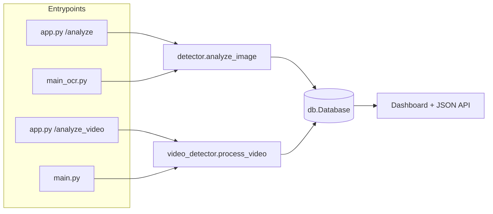
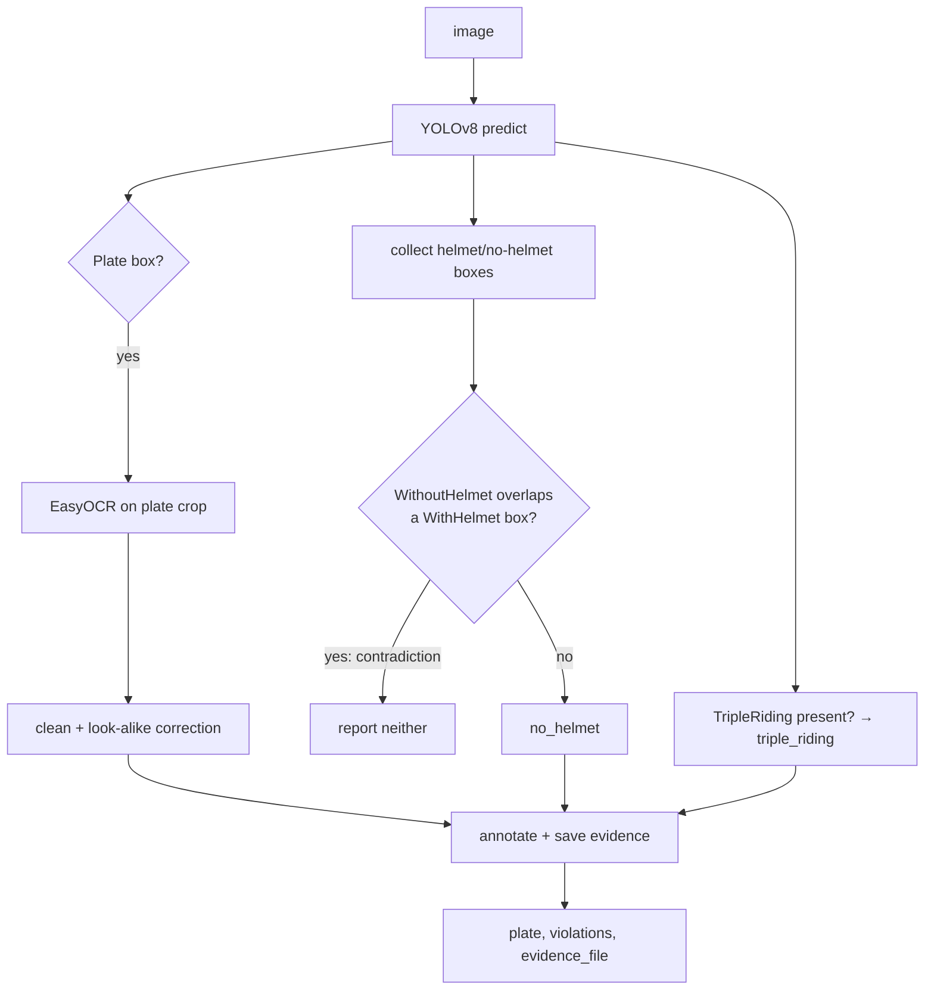
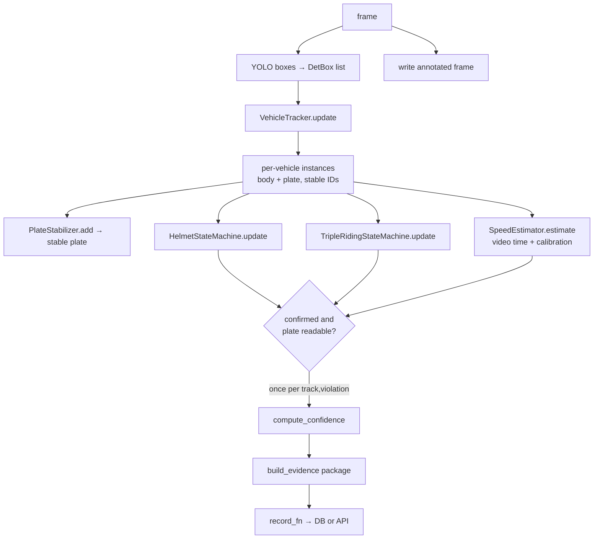
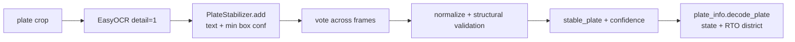
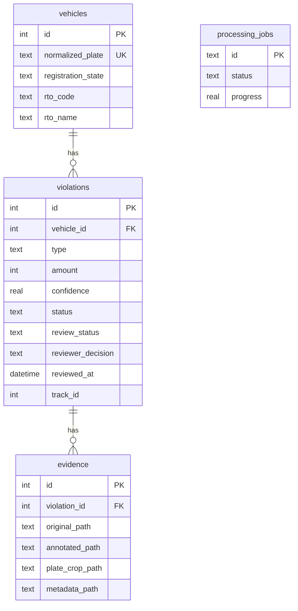

# Architecture

This document describes how the system is put together. For *why* the important
choices were made, see [DECISIONS.md](DECISIONS.md).

## Overview

Three loosely-coupled layers share one detection core:

1. **Detection & reasoning** (`modules/`) — turns pixels into confirmed,
   confidence-scored violations with evidence. Pure Python + OpenCV, with the
   heavy model libraries (torch / ultralytics / easyocr) isolated behind lazy
   imports.
2. **Persistence** (`modules/db.py`) — a normalized SQLite store.
3. **Delivery** (`app.py` + `templates/frontend.html`, and the CLIs) — a Flask
   API + dashboard, plus `main.py` / `main_ocr.py` for headless use.

## Image pipeline

`modules/detector.py :: analyze_image` — single frame, no temporal state:

This same function backs both the `/analyze` route and `main_ocr.py`, so the
web and CLI paths can't diverge.

## Video pipeline

`modules/video_detector.py :: process_video` — per-call state (its own tracker,
stabilizers, state machines, reported-set), safe to run from a web request:

### Tracking (`modules/vehicle_tracker.py`, `modules/vehicle.py`)

`VehicleTracker` maintains a set of `VehicleTrack`s with a lifecycle
(`tentative → confirmed → lost`) and stable integer IDs. Each frame it builds
candidate per-vehicle instances from the raw boxes, then matches them to existing
tracks by IoU/centroid distance. A track survives a few missed frames before it
is dropped, so a brief occlusion doesn't spawn a new ID.

### Association (`modules/association.py`, `modules/geometry.py`)

Within a frame, plate boxes and rider/violation boxes are matched **one-to-one**
with the Hungarian algorithm over a geometric cost (overlap / containment /
distance). This is the core "which plate belongs to which rider" step and is what
makes multi-bike frames tractable, versus the old nearest-plate heuristic.

## OCR pipeline (`modules/plate_recognizer.py`, `modules/plate_info.py`)

The pipeline fines only against `stable_plate`. `plate_info` decodes the
registration *region* from the public plate-code scheme; it never resolves owner
identity.

## Violation decision engine

- `modules/violation_state.py` — `HelmetStateMachine` and
  `TripleRidingStateMachine`. States confirm only after a persistence window and
  a confidence floor, decay gracefully, and never un-confirm (so a fine is issued
  at most once). The helmet machine reports `ambiguous` on a contradiction.
- `modules/confidence.py` — `compute_confidence` merges detection / temporal /
  association / OCR into a transparent weighted mean. **Not a probability.**

## Evidence (`modules/evidence.py`)

`build_evidence` writes the original + annotated frame, plate + violation crops,
and a JSON sidecar (timestamp, frame index, track id, plate, violation, full
confidence breakdown, supporting frames, speed/calibration). Uniquely tokenized
names; basenames stored for portability.

## Database (`modules/db.py`)

`initialize()` is idempotent: creates tables/indexes `IF NOT EXISTS`, migrates a
legacy flat `fines` table once, and `ALTER`s in the review columns for older DBs.
A fresh connection per operation, foreign keys on, related inserts in one
transaction.

## Web application (`app.py`, `templates/frontend.html`)

Flask routes (see [API.md](API.md)) for detection, lookup, analytics/filtering,
review, and evidence serving. Models load lazily and are cached behind a lock.
The single-page dashboard (vanilla JS, Apple-style CSS) drives the JSON API.

## Asynchronous video jobs (`modules/jobs.py`)

`JobManager` runs each video in a background thread with a typed lifecycle
(`processing / done / error / cancelled`), a concurrency cap, cooperative
cancellation via an event the worker polls, progress reporting, and lazy
expiry of finished jobs. In-process and dependency-free — see
[DECISIONS.md](DECISIONS.md) for why not Celery/Redis.

## Configuration & observability

- `modules/config.py` — one typed tree (`AppConfig`/`ServerConfig`/
  `DetectionConfig`) built from the environment via `from_env`, read at import so
  test reloads pick up patched env.
- `modules/logging_setup.py` — an idempotent project logger (`tws.*`) for
  application events; the CLIs keep friendly `print()` output.
