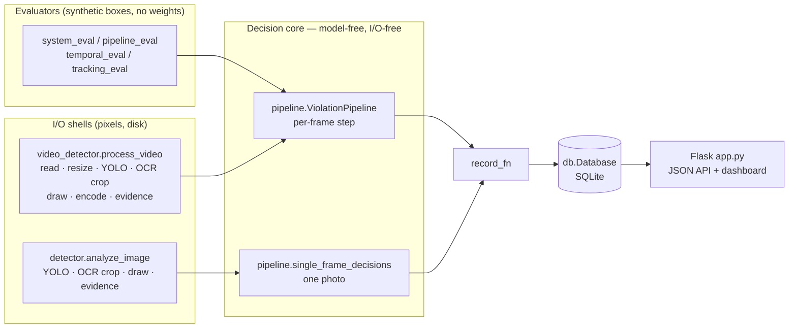
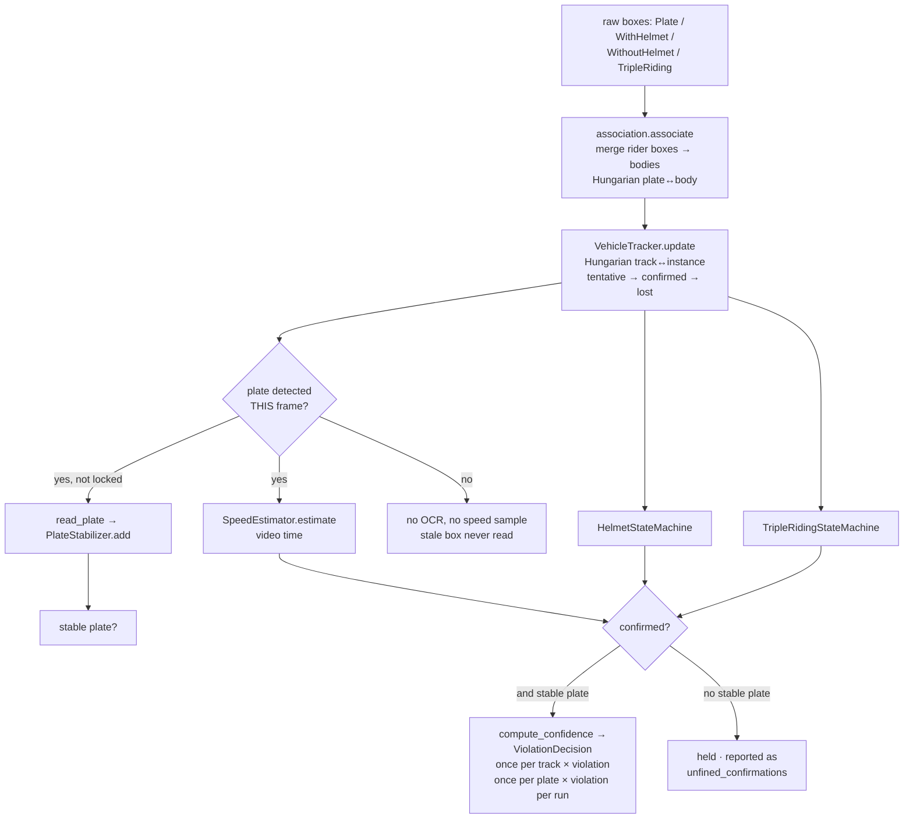
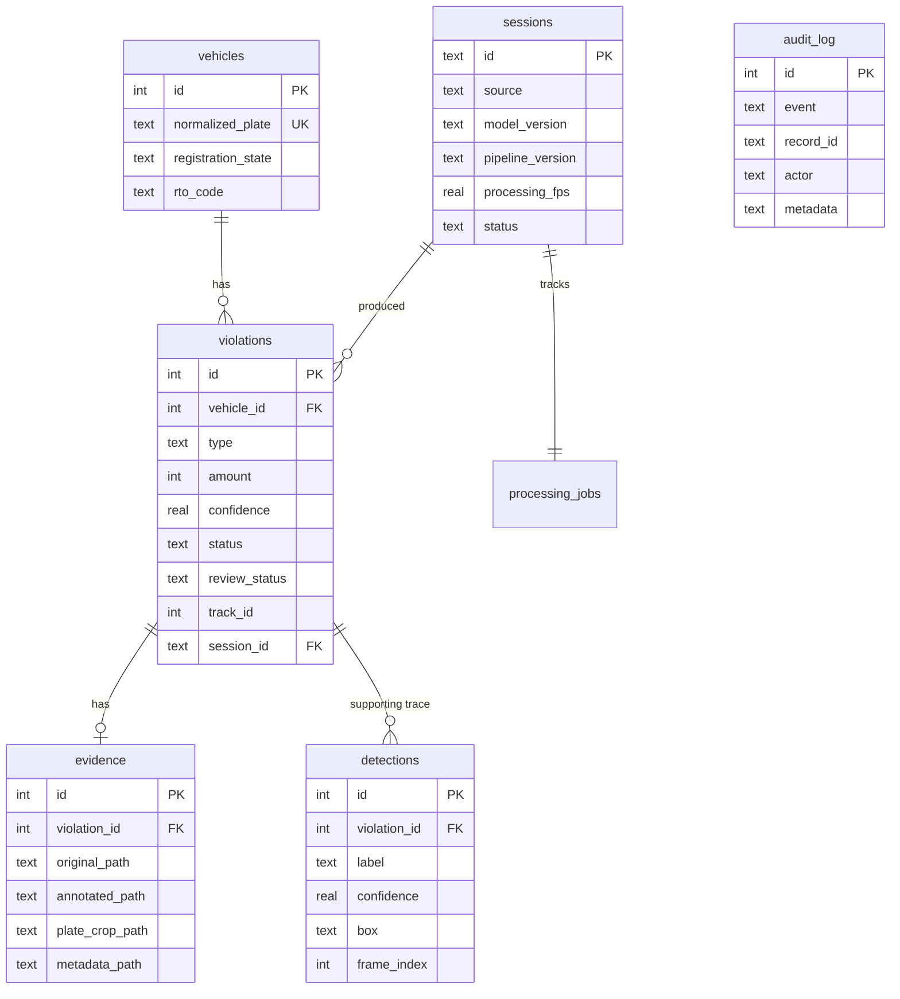

# Architecture

How the system is put together. The *why* behind each choice is in
[DECISIONS.md](DECISIONS.md); how each stage is measured is in
[EVALUATION.md](EVALUATION.md).

## The shape of it

One decision core, two I/O shells, one store, and a set of evaluators that drive
the *same* core the web job runs.

```mermaid
flowchart LR
    subgraph Shells["I/O shells (pixels, disk)"]
        VD[video_detector.process_video<br/>read · resize · YOLO · OCR crop<br/>draw · encode · evidence]
        IM[detector.analyze_image<br/>YOLO · OCR crop · draw · evidence]
    end
    subgraph Core["Decision core — model-free, I/O-free"]
        VP[pipeline.ViolationPipeline<br/>per-frame step]
        SF[pipeline.single_frame_decisions<br/>one photo]
    end
    subgraph Eval["Evaluators (synthetic boxes, no weights)"]
        SE[system_eval / pipeline_eval<br/>temporal_eval / tracking_eval]
    end
    VD --> VP
    IM --> SF
    SE --> VP
    VP --> REC[record_fn]
    SF --> REC
    REC --> DB[(db.Database<br/>SQLite)]
    DB --> API[Flask app.py<br/>JSON API + dashboard]
```

Entry points: `app.py` (`/analyze`, `/analyze_video` → background job),
`main.py` (video CLI), `main_ocr.py` (photo CLI). All of them call the same
shells, and the shells call the same core.

## The per-frame decision core — `modules/pipeline.py`

`ViolationPipeline.step(frame_index, dets, timestamp, read_plate)` is the whole
decision for one frame. It never touches pixels: OCR is injected as
`read_plate(plate_box) -> (text, confidence)`, so the core imports no
torch/cv2/easyocr and runs in CI.

```mermaid
flowchart TD
    D[raw boxes: Plate / WithHelmet /<br/>WithoutHelmet / TripleRiding] --> A[association.associate<br/>merge rider boxes → bodies<br/>Hungarian plate↔body]
    A --> T[VehicleTracker.update<br/>Hungarian track↔instance<br/>tentative → confirmed → lost]
    T --> V{plate detected<br/>THIS frame?}
    V -->|yes, not locked| O[read_plate → PlateStabilizer.add]
    V -->|yes| S[SpeedEstimator.estimate<br/>video time]
    V -->|no| X[no OCR, no speed sample<br/>stale box never read]
    T --> H[HelmetStateMachine]
    T --> TR[TripleRidingStateMachine]
    O --> P[stable plate?]
    H --> C{confirmed?}
    TR --> C
    S --> C
    C -->|and stable plate| E[compute_confidence →<br/>ViolationDecision<br/>once per track × violation<br/>once per plate × violation per run]
    C -->|no stable plate| HOLD[held · reported as<br/>unfined_confirmations]
```

### Association — `modules/association.py`

1. **Merge rider boxes into bodies.** WithHelmet / WithoutHelmet / TripleRiding
   boxes are the same physical vehicle if IoU > 0.5 or one is ≥ 80% contained
   in the other (connected components). A WithHelmet + WithoutHelmet pair merged
   onto one body sets `ambiguous_helmet` — the contradiction safeguard.
2. **Pair plates to bodies one-to-one** with the Hungarian algorithm over
   `dist/body_diag + 1.5·(1 − horizontal overlap) + 0.5·(plate above rider)`,
   gated: a pair with no horizontal overlap and centroids > 1.2 body diagonals
   apart is forbidden, so a plate with no plausible rider stays unmatched rather
   than being forced onto one.

The merge thresholds were raised from 0.3 / 0.6 after `tracking_eval.py`
showed two crossing riders at IoU 0.43 being merged into one vehicle.

### Tracking — `modules/vehicle_tracker.py`, `modules/vehicle.py`

Each association instance gets an anchor box (union of body and plate). Tracks
are velocity-predicted and matched to anchors by a gated Hungarian assignment on
`(1 − IoU) + 0.5 · centroid distance / diagonal`. A track needs 3 hits to confirm,
survives 15 missed frames (`LOST`), then is removed; an unconfirmed track that
misses once is dropped. IDs come from a monotonic counter and iteration is
sorted, so runs are deterministic.

`VehicleTrack.plate_box` is the *last* plate box seen and can be stale;
`plate_visible` says whether the plate was detected in the current frame. OCR,
speed samples and evidence plate crops all require `plate_visible`.

### OCR — `modules/plate_recognizer.py`, `modules/plate_info.py`

Per frame: EasyOCR `detail=1` on the plate crop; the reading's confidence is its
weakest text box. `PlateStabilizer` normalises, applies look-alike correction
*only* toward a valid Indian plate structure (≤ 2 edits: `O↔0`, `I↔1`, `B↔8`, …),
down-weights structurally invalid reads ×0.25, and elects a plate by
confidence-weighted vote. It **abstains** unless the winner has ≥ 3 valid
readings of its own, holds ≥ 35% of vote weight, and beats the best competing
valid plate by ≥ 0.3 of the weight; an exact tie always abstains. Abstentions
carry a reason (`too_few_supporting_reads`, `contested`, `low_agreement`,
`no_valid_reading`, …). Once a plate is elected with agreement ≥ 0.9 over ≥ 5
reads, OCR runs only every 10th visible frame for that track (the measured
optimisation) — and a re-read that disagrees breaks the lock. A fine also needs
a valid reading that **agreed with the elected plate within the last 25 frames**
on that track, so a track whose identity switched cannot be fined under the
previous vehicle's plate (withheld as `plate_not_recently_confirmed`). `plate_info` decodes
the registration region (state + RTO) from the public code scheme; it never
resolves an owner.

### Violation state machines — `modules/violation_state.py`

- **Helmet.** No-helmet needs 5 consecutive supporting frames (box confidence
  ≥ `HELMET_MIN_CONF`) **and** ≥ 70% supporting frames over ≥ 12 observed frames.
  A helmet frame resets a pending streak; one blank frame is tolerated; a
  contradicting frame (helmet and no-helmet on one body) advances nothing.
  Confirmation never reverts, so a fine is issued at most once.
- **Triple riding.** 5 consecutive frames ≥ `TRIPLE_MIN_CONF`.
- **Overspeed.** 5 consecutive valid over-limit speed estimates; a frame
  without a measurement holds the streak, a measured under-limit frame resets it.

Both machines also support a k-of-n vote (`vote_window`); it was measured and
rejected (more false flags) and is off by default.

### Speed — `modules/speed.py`

Distance from plate-centre displacement, time from **video** timestamps
(`frame_index / fps`), so the result is independent of processing speed.
Calibration is `pixels_per_meter` measured on *source* frames and scaled by the
same factor the frame was resized by. Optional linear-plane or 4-point
homography calibration corrects perspective. Median over a 5-sample window,
instantaneous speeds > 150 km/h rejected, ≥ 3 samples and ≥ 0.2 s required, and
each estimate carries its spread as uncertainty. Without calibration, speed and
overspeed are skipped — never guessed.

### Confidence — `modules/confidence.py`

Equal-weight mean of four components in [0, 1]: detection (best box confidence;
for overspeed, margin over the limit), temporal (supporting frames / window),
association (plate-under-rider horizontal overlap from the last frame both were
seen), OCR (stabilizer agreement). **A ranking score, not a probability** — see
[MODEL_EVALUATION.md](MODEL_EVALUATION.md) for how poorly raw detector
confidence tracks correctness on some classes.

## The photo path — `pipeline.single_frame_decisions`

No time axis, so no streaks and no vote. It uses the same `associate()` so each
violation is attributed to the plate under *that* rider, and is stricter to
compensate: the plate must read (after ≤ 2 look-alike corrections) as a valid
plate, and a no-helmet box overlapping *any* helmet box above
`CONTRADICTION_IOU` abstains. Everything not recorded is returned with a reason.

## Evidence — `modules/evidence.py`

Per recorded violation: original frame, annotated frame, plate crop (only if the
plate is in *this* frame), violation crop, and a JSON sidecar with video time,
frame index, track id, plate, the plate vote (agreement, margin, runner-up,
observation count), the confidence breakdown, speed, model and pipeline
versions, the thresholds actually applied, and a SHA-256 of every image.
`verify_evidence` re-hashes and reports tampering. Filenames carry a random
token; the DB stores basenames and links the whole package.

## Persistence — `modules/db.py`

```mermaid
erDiagram
    vehicles ||--o{ violations : has
    violations ||--o| evidence : has
    violations ||--o{ detections : "supporting trace"
    sessions ||--o{ violations : produced
    sessions ||--|| processing_jobs : tracks
    vehicles { int id PK  text normalized_plate UK  text registration_state  text rto_code }
    violations { int id PK  int vehicle_id FK  text type  int amount  real confidence  text status  text review_status  int track_id  text session_id FK }
    evidence { int id PK  int violation_id FK  text original_path  text annotated_path  text plate_crop_path  text metadata_path }
    sessions { text id PK  text source  text model_version  text pipeline_version  real processing_fps  text status }
    detections { int id PK  int violation_id FK  text label  real confidence  text box  int frame_index }
    audit_log { int id PK  text event  text record_id  text actor  text metadata }
```

Three independent lifecycles on a violation, never overloaded onto one field:
`detection_status` (pipeline), `review_status` (human: pending → confirmed |
dismissed), `status` (payment: unpaid → paid | cancelled, compare-and-set).
Related inserts share one transaction; foreign keys are on; `initialize()` is
idempotent and migrates older databases in place.

## Web application — `app.py`, `modules/jobs.py`, `modules/validation.py`

Flask JSON API + a single-page dashboard. Models load lazily behind a lock.
Video runs as an in-process background job (`JobManager`: concurrency cap,
cooperative cancellation, progress, expiry); its session is persisted as
`completed`, `cancelled` or `truncated` with the measured processing FPS. Uploads
are extension- and content-sniffed; write endpoints are rate-limited and, with
role keys configured, role-gated. See [API.md](API.md) and
[SECURITY.md](SECURITY.md).

## Evaluation tooling

| tool | question | needs |
|---|---|---|
| `evaluate_model.py` | detector mAP (standard protocol), confusions, failure crops | weights + data |
| `evaluate_uncertainty.py` | AP with CIs; is model A really better than B? | weights + data |
| `evaluate_robustness.py` | AP drop under synthetic blur/low-light/glare/… | weights + data |
| `audit_dataset.py` / `audit_labels.py` | leakage; label quality; source composition | data |
| `evaluate_pipeline.py` | end-to-end fines, decisions, error budget, OCR policy, speed | nothing |
| `evaluate_temporal.py` | which confirmation rule | nothing (rates from a val report) |
| `evaluate_ocr.py --simulate --policy-sweep` | which OCR vote thresholds | nothing |
| `benchmark.py` | latency, throughput, per-stage profile | weights |

Every report carries a provenance block (`modules/provenance.py`): weights
SHA-256 and registered version, dataset content fingerprint, split fingerprint,
git commit and dirty flag, library versions, hardware.

## Configuration — `modules/config.py`

One typed tree built from the environment at import (so a test that patches the
env and re-imports gets fresh values). `pipeline_config_from_detection` maps it
onto `PipelineConfig`, so every documented detection variable is the value the
pipeline applies and the value evidence records.
